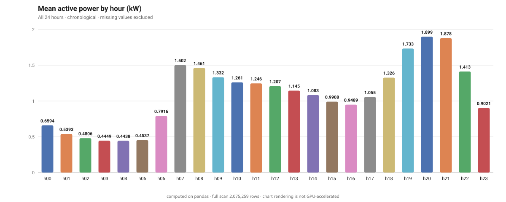
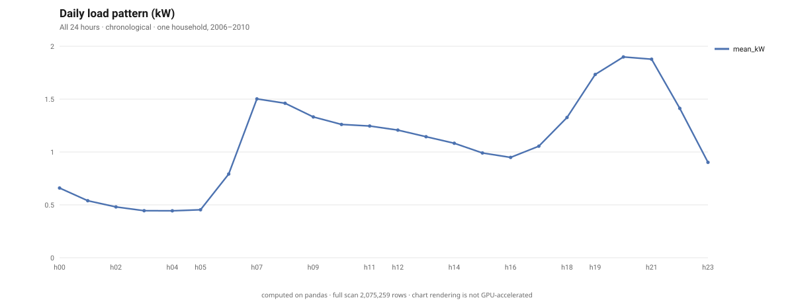

# 真实家庭用电：什么时候负荷最高？

- 数据来源：`power_demo.csv`
- 分析行数：**2,075,259** (全量扫描，非抽样)
- 计算引擎：**pandas**
- 生成时间：2026-09-26 18:30:57

- 操作：`groupby`

## 分组聚合

分组字段 `hour`，聚合方式 `Global_active_power:mean,count`；共 24 组，展示前 24 排序依据 `Global_active_power__mean`。

| `hour` | `Global_active_power__mean` | `Global_active_power__count` |
| ---: | ---: | ---: |
| h20 | 1.899 | 85,615 |
| h21 | 1.878 | 85,529 |
| h19 | 1.733 | 85,542 |
| h07 | 1.502 | 85,284 |
| h08 | 1.461 | 85,295 |
| h22 | 1.413 | 85,553 |
| h09 | 1.332 | 85,316 |
| h18 | 1.326 | 85,347 |
| h10 | 1.261 | 85,248 |
| h11 | 1.246 | 85,248 |
| h12 | 1.207 | 85,317 |
| h13 | 1.145 | 85,340 |
| h14 | 1.083 | 85,405 |
| h17 | 1.055 | 85,334 |
| h15 | 0.9908 | 85,378 |
| h16 | 0.9489 | 85,335 |
| h23 | 0.9021 | 85,560 |
| h06 | 0.7916 | 85,259 |
| h00 | 0.6594 | 85,491 |
| h01 | 0.5393 | 85,440 |
| h02 | 0.4806 | 85,439 |
| h05 | 0.4537 | 85,260 |
| h03 | 0.4449 | 85,428 |
| h04 | 0.4438 | 85,317 |

## 图表

### groupby bar

### groupby line

## 计算方式说明

统计由 `pandas` 全文计算得出。本报告中的数字是精确聚合值，不是抽样估计。

本次走的是 CPU 路径，因此不声称任何 GPU 加速。

## 从真实数据得到的发现

全量 2,075,259 条分钟记录中，20 时平均有功功率最高：1.8991 kW；04 时最低：0.4438 kW。峰谷均值比为 4.28 倍。

下一步可按工作日与周末、月份分别复核，再检查高负荷时段的分表用电。这是调查优先级，不代表可直接节省同等比例电费。

## 数据来源与边界

Georges Hebrail、Alice Berard：Individual Household Electric Power Consumption，UCI，DOI 10.24432/C58K54，CC BY 4.0。来源：https://archive.ics.uci.edu/dataset/235/individual+household+electric+power+consumption

仅代表一户家庭在 2006–2010 年的历史记录，不能外推到所有家庭。有功功率缺失 25,979 条；均值排除缺失值，逐小时有效样本数随报告提供。没有采样、没有复制记录放大数据、没有注入信号。相关性不证明因果，IQR 异常不等于故障。本演示证明分析价值；大规模性能另用独立基准证明。
